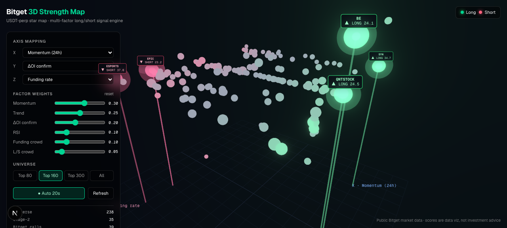

# Bitget 3D Strength Map — multi-factor long/short signal engine

An online **3D visualization** that plots every Bitget USDT-perpetual contract as
a rotatable "strength star map", scores each symbol live across multiple
dimensions (momentum, open interest, funding-rate crowding, RSI, EMA trend), and
auto-highlights the **best long** and **best short** candidates. The same engine
powers an **Agent-callable signal API** and a **transparent, tunable scoring
model**.

> Built for the Bitget Hackathon · Track 2 (Trading Infra). Uses **public market
> data only — no API key, no login**.



## What it delivers (Track 2, three angles at once)

- **Trader product** — the rotatable 3D star map dashboard with long/short highlights.
- **Agent tool** — `GET /api/signals` returns structured top long/short candidates in one fetch.
- **Strategy evaluation** — fully transparent weighted scoring; every factor's contribution is exposed per symbol and every slider re-scores live.

## Quick start (zero keys)

```bash
pnpm install
pnpm dev
# open http://localhost:3000
```

That's it — the backend proxies Bitget's public endpoints, so there is nothing
to configure.

## Agent / API usage

```bash
# Top 5 long candidates over symbols with >$5M 24h volume
curl "http://localhost:3000/api/signals?direction=long&top=5&minVolume=5000000"

# Top 5 shorts
curl "http://localhost:3000/api/signals?direction=short&top=5"

# Override factor weights inline (w_mom, w_trend, w_oi, w_rsi, w_fund, w_ls)
curl "http://localhost:3000/api/signals?direction=long&top=5&w_mom=0.5&w_trend=0.4"
```

Response shape (see `samples/` for full examples):

```jsonc
{
  "generatedAt": "2026-06-19T...Z",
  "universe": 90,
  "direction": "long",
  "weights": { "mom": 0.3, "trend": 0.25, "oi": 0.2, "rsi": 0.1, "fund": 0.1, "ls": 0.05 },
  "results": [
    {
      "symbol": "SYNUSDT",
      "rank": 1,
      "score": 30.53,
      "factors": { "mom": 0.30, "trend": 0.30, "oi": 0, "rsi": 0.01, "fundCrowd": 0, "lsCrowd": 0 },
      "snapshot": { "lastPr": "...", "change24h": "...", "fundingRate": "...", "oi": "...", "volume": "...", "markPrice": "..." }
    }
  ],
  "disclaimer": "Data-visualization scores only. Not investment advice."
}
```

### Other endpoints

| Endpoint | Purpose |
|---|---|
| `GET /api/market/snapshot?minVolume=1000000` | Full-market factored nodes for the 3D field (client re-scores live as sliders move). |
| `GET /api/market/klines?symbol=BTCUSDT&granularity=1H&limit=200` | Single-symbol K-line proxy for the detail panel. |
| `GET /api/signals?...` | Agent-facing ranked long/short signals. |

## How the scoring works (`lib/scoring.ts`)

Two-stage, rate-limit-friendly:

1. **Stage 1 (one tickers call, whole market):** momentum (`change24h`), funding-rate
   crowding, OI level, liquidity — robustly standardized (median/MAD → `tanh`).
2. **Stage 2 (shortlist ~36 by directional bias):** pull K-lines and add EMA50 trend,
   RSI, multi-period momentum, and ΔOI confirmation.

Composite (every factor aligned so **positive = bullish**):

```
bias        = w_mom·mom + w_trend·trend + w_rsi·rsi + w_oi·oi
crowd_long  = w_fund·max(0,  fundZ) + w_ls·max(0,  lsZ)
crowd_short = w_fund·max(0, -fundZ) + w_ls·max(0, -lsZ)
LongScore   = clamp01(bias  - crowd_long ) · liqGate · 100
ShortScore  = clamp01(-bias - crowd_short) · liqGate · 100
```

Extreme positive funding (crowded longs) lowers the long score and lifts the
short score — crowded-trade contrarianism is baked into the model. Low-liquidity
symbols are gated down (`liqGate`) or filtered out (`minVolume`).

`computeFactors()` (cross-sectional, runs once server-side) and `combine()`
(pure per-symbol) are shared by server and client, so weight-slider changes
re-score instantly in the browser with no refetch.

## Auditable usage records

All Bitget access flows through the single gate in `lib/bitget.ts`. Every call —
cache hit or real network — is appended to `logs/bitget-calls.jsonl` with
timestamp, full URL, cache-hit flag, latency, and a cumulative real-call counter.
Business calls to `/api/signals` are logged to `logs/api-signals.jsonl`. This
proves the data is genuinely Bitget's and that rate limits are respected (funding
1 req/s, candles ~20 req/s) via in-memory TTL caching.

```bash
# real outbound calls vs. cache hits
grep -c '"cacheHit":false' logs/bitget-calls.jsonl
grep -c '"cacheHit":true'  logs/bitget-calls.jsonl
```

## Architecture

```
Browser (React 19 + R3F + Bloom)
  ├─ ControlPanel: axis mapping · weight sliders · universe · auto-refresh
  └─ 3D star map: instanced nodes · long/short beacons · hover factor breakdown · detail panel
        │ fetch /api/*
Next.js Route Handlers (server; solves CORS, caches, rolls OI snapshots)
        │ fetch (public data, no key)
Bitget public market API v2
```

Key files: `lib/bitget.ts` (gated client + cache + logging), `lib/scoring.ts`
(engine), `lib/pipeline.ts` (two-stage build), `lib/oiBuffer.ts` (ΔOI sampling),
`components/Scene.tsx` + `NodeField` + `Highlights` (3D), `store/useStore.ts`
(zustand).

## Tech / version notes

Next 16 · React 19 · R3F 9 · drei 10 · @react-three/postprocessing 3 · three 0.184 ·
zustand 5 · recharts 3 · lru-cache 11.

> Note: drei is pinned to **v10**, not the v9 some early specs reference — drei
> v9 peers with React 18 / R3F 8 and will not install against React 19 / R3F 9.

## Limitations

- ΔOI uses rolling in-memory snapshots (Bitget has no historical OI endpoint), so
  it reads 0 on cold start until a second refresh lands.
- On Vercel serverless, the in-memory cache / OI buffer reset on cold starts and
  `logs/` writes are ephemeral; swap to Vercel KV / Upstash for durable audit.
- Long/short ratio (1 req/s) is wired in the client but off by default to stay
  well under rate limits; all other factors are independent of it.

## Disclaimer

Scores are a data-visualization aid over public market data. **Not investment advice.**
